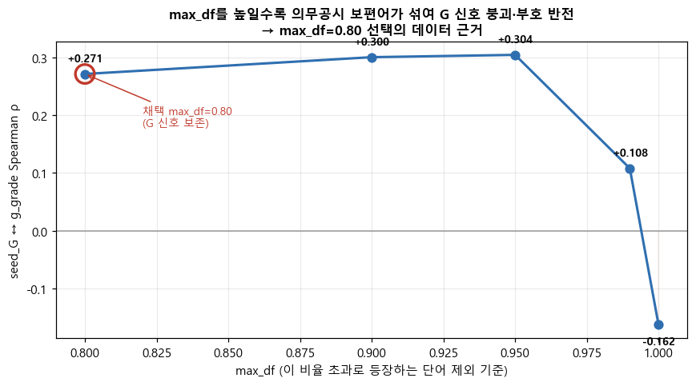
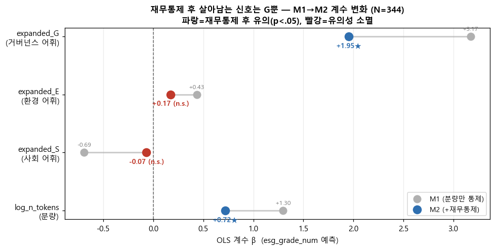
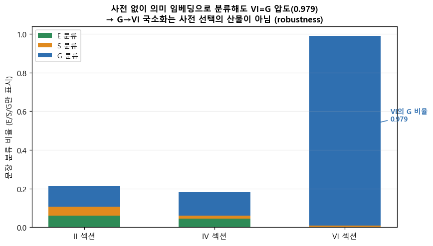

# 한국 상장기업 사업보고서의 ESG 어휘 강도는 KCGS 등급을 설명하는가: 공시 장황성 통제와 지배구조 신호의 섹션 국소화

**김혜성, 이동원, 김지우, 신지영**

비정형 데이터 처리 Final Term Project | 3조

---

## 초록

사업보고서에 담긴 ESG 관련 표현이 한국ESG기준원(KCGS) 등급 평가와 어떤 통계적 연관을 갖는지 분석하였다. 127개 한국 상장기업의 2022–2024 회계연도 사업보고서(381 firm-year)를 대상으로 TF-IDF 기반 seed·expanded dictionary와 FastText 단어 임베딩을 결합해 환경(E)·사회(S)·지배구조(G) 차원의 어휘 강도를 측정하고, OLS·Ordered Logit·Binary Logit 3종 회귀로 공시 분량을 통제한 뒤 등급과의 연관을 추정하였다. 단순 토큰 수의 Spearman ρ(0.663)가 모든 ESG feature를 압도하며 A 이상 등급 기업이 B+ 이하 기업보다 평균 2.1배 긴 보고서를 작성한다는 사실은 공시 장황성이 연관의 주요 원천임을 시사한다. 분량과 재무규모를 동시에 통제한 후에도 G expanded 어휘는 독립 신호를 유지하는 반면(β=1.955, p<0.001), E는 유의성이 소멸하고 S는 모든 모형에서 비유의이다. 추가 분석에서 G 신호는 이사회 공시 섹션(VI)에 집중되어 전체 문서 대비 등급 상관이 0.426에서 0.526으로 선명해지며, 이는 어휘 사전에 의존하지 않는 의미 임베딩 분류(VI 문장의 97.9%가 G로 분류)에서도 일관되게 재현된다. 모든 결과는 연관 관찰이며 인과 추론으로 해석할 수 없다.

---

## 1. Introduction

기업 ESG 공시와 외부 평가 등급 사이의 연결은 투자자·규제 당국·학계 모두에게 실질적 의미를 갖는다. 공시 언어가 실제 ESG 성과를 충실히 반영한다면 사업보고서 텍스트는 등급의 선행 지표로 기능할 수 있다. 그러나 보고서 작성 인프라가 갖춰진 대형 기업일수록 ESG 관련 표현도 길고 정교하게 쓰는 경향이 있어, 공시 분량 자체가 ESG 성과와 무관하게 등급과 동조할 수 있다. 이 문제를 이후 분석에서는 "cheap-talk"으로 표현한다. 이는 거짓 공시라는 단정이 아니라, 공시 표현의 양과 외부 평가가 강하게 연동되어 실제 성과와 공시 언어 사이의 괴리가 생길 수 있다는 해석 틀이다.

ESG 등급 간 불일치 문제는 이미 선행 연구에서 지적된 바 있다. Berg et al.(2022)은 주요 6개 ESG 평가기관 간 등급 상관이 0.38–0.71에 불과해 신용등급(0.99)과 극명하게 대비된다는 점을 보이며, 평가 방법론의 차이가 불일치의 절반 이상을 설명한다고 분석하였다. 단일 평가기관 등급과 텍스트 기반 측정치를 연결하는 본 연구는 이 맥락에서 사업보고서가 KCGS 평가 정보를 얼마나 담아내는지를 확인하는 성격이 있다. 또한 Loughran and McDonald(2011)가 10-K 공시 분석에서 제기한 도메인 특화 어휘 사전의 필요성은, 우리가 범용 사전 대신 corpus 내부에서 학습한 FastText로 expanded dictionary를 구축한 방법론적 결정의 배경이 된다.

본 연구의 분석 단위는 `stock_code × fiscal_year` firm-year이며, 두 가지 질문에 답하고자 한다. 첫째, 사업보고서 ESG 어휘 강도는 KCGS 등급과 통계적으로 연관되는가, 그리고 그 연관은 공시 분량 효과를 통제한 뒤에도 유지되는가. 둘째, 분량 통제 후 남는 ESG 신호는 보고서의 어느 섹션에 집중되어 있는가.

본 연구의 기여는 두 가지이다. 우선 공시 분량 효과를 명시적으로 분리하고 차원별 독립 신호의 존재 여부를 검증한 점이다. 또한 섹션 수준 분석을 통해 G 신호가 이사회 공시 섹션(VI)에 국소화될 때 측정 정밀도가 높아진다는 점을 정량화하였다.

---

## 2. Data

### 2.1 표본 구성

분석 대상은 KCGS ESG 등급이 부여된 한국 상장기업 127개의 2022·2023·2024 회계연도 사업보고서로, firm-year 단위 패널 381행을 구성하였다. 회사명이 아닌 `stock_code × fiscal_year`를 분석 단위로 삼은 이유는 사명 변경·지주회사 전환·표기 차이 때문에 회사명 기준 병합 시 조용한 오매칭이 발생할 수 있기 때문이다. 실제 데이터에서 고유 회사명은 133개이나 고유 종목코드는 127개로 차이가 있었다.

사업보고서는 DART(전자공시시스템) OpenAPI를 통해 `stock_code → corp_code → rcept_no → document.xml` 경로로 수집하였다. 정정공시는 최신본 우선으로 처리하였으며 반기·분기보고서는 분석 기간이 달라 제외하였다. 381건 전수 수집에 성공하였다(SUCCESS 381/381).

KCGS 등급은 D=0, C=1, B=2, B+=3, A=4, A+=5의 순서형 변수로 변환하였다. 본 표본의 최고 등급은 A+이며 S(6)에 해당하는 관측치는 없다. 등급 변환은 서열 정보만을 활용하는 것이며 등급 간 간격이 동일하다는 의미가 아니다. 이 점을 고려해 OLS 외에 Ordered Logit과 Binary Logit을 병행하였다.

### 2.2 섹션 추출

사업보고서 전체를 분석에 사용하지 않고 II(사업의 내용)·IV(이사의 경영진단 및 분석의견)·VI(이사회 등 회사의 기관에 관한 사항) 세 섹션을 추출하였다. 섹션을 제한한 이유는 다음과 같다. 재무제표 주석·표·안내 문구 등은 ESG 어휘의 빈도를 왜곡할 수 있으며, II·IV·VI는 환경·사회·지배구조 관련 서술이 실제 문장으로 나타날 가능성이 높고 기업 간 구조적 비교가 가능한 대분류이다. 섹션 경계는 보고서마다 세부 항목명이 달라도 안정적인 로마숫자 대분류 제목을 기준으로 구분하였으며, 표 블록은 제거하고 10자 미만 단편은 제외하였다. 추출 결과 II·IV·VI 전 섹션에서 0자 firm-year는 없었다.

### 2.3 공시 분량 분포

추출된 텍스트의 글자 수는 평균 34,773자, 최소 4,513자, 최대 189,606자로 편차비가 42배에 달한다. 이 극단적 편차는 ESG 단어 빈도가 높다는 사실만으로 ESG 성과가 우수하다고 단정하기 어렵게 만드는 근본 조건이다.

| 항목 | 값 |
|---|---:|
| 평균 | 34,773자 |
| 중앙값 | 25,872자 |
| 최소 | 4,513자 |
| 최대 | 189,606자 |
| 편차비 | 42.0배 |

*표 1. 사업보고서 추출 텍스트 글자 수 분포 (381 firm-year)*

---

## 3. Method

### 3.1 한국어 형태소 분석기 선택

한국어 사업보고서는 조사·어미가 단어에 결합하고 복합명사가 많아 공백 기준 토큰화로는 ESG 개념 단위를 안정적으로 추출할 수 없다. 형태소 분석기는 Kiwi와 Okt를 corpus 샘플 30개에서 seed 보존율·복합명사 처리·속도 기준으로 비교하였으며, 추가로 BERT 계열 subword 토크나이저(`klue/bert-base`)와도 비교하였다.

**그림 1. 형태소 분석기 seed 보존율 비교**

*Kiwi 사용자 사전(좌측 짙은 막대)이 Kiwi 기본과 HF subword 대비 전 차원에서 seed를 더 많이 보존한다. HF subword는 `넷제로`→`넷+##제+##로`, `감사위원회`→`감사+##위원+##회`처럼 ESG 합성어를 빈번히 분리해 사전 기반 점수 계산에 적합하지 않다.*

Kiwi 기본의 seed 보존율은 18/30(60%)이나, seed 30개를 고유명사(NNP)로 등록하고 인식 우선순위를 높인 사용자 사전 적용 후 28/30(93%)으로 상승하였다. HF subword는 16/30(53%)에 머물렀다. 복합명사 보존이 핵심 요건인 본 분석에서 Kiwi+사용자 사전을 채택하였다. 토큰화 단위는 일반명사(NNG)·고유명사(NNP) 2자 이상으로 제한하였다.

불용어는 일반 경영어·회사명 분해 토큰·공시 정형어 3종으로 구성하였다. 회사명을 형태소 분리할 때 `에너지`·`보건` 등 ESG 관련어가 불용어에 유입될 위험을 방지하기 위해 seed 30개와 ESG 관련어 31개(probe set)를 불용어에서 강제 제외하였다.

### 3.2 Feature 구성

**Seed TF-IDF.** E·S·G 각 10개씩 30개 seed를 기반으로 TF-IDF 행렬(381 × 6,811)을 학습하고, 각 차원 seed에 해당하는 TF-IDF 값을 합산해 `seed_score_E/S/G`를 산출하였다. 핵심 파라미터는 `min_df=5`(희귀 노이즈 제거), `max_df=0.80`(전 문서에 거의 항상 등장하는 보일러플레이트 제거), `sublinear_tf=True`(빈도의 과대 반응 완화)이다.

`max_df=0.80`은 G seed 7개(`이사회`·`사외이사`·`주주` 등)를 어휘에서 제외시킨다. 이 제외가 G 신호를 인위적으로 약화시키는 artifact인지 확인하기 위해 `max_df`를 0.80에서 1.00까지 높이며 seed_G ↔ g_grade ρ를 추적하였다.

**그림 2. max_df 값에 따른 seed_G ↔ g_grade Spearman ρ 변화**

*max_df=0.80–0.95 구간에서 ρ는 0.271–0.304로 안정적이나, 0.99에서 0.108로 급락하고 1.00에서 −0.162로 반전된다. 보편어(`이사회`·`주주`)는 변별력이 없을 뿐 아니라 보일러플레이트 반복이 오히려 낮은 등급과 연관된다. 따라서 max_df=0.80 선택은 신호 보존을 위한 견고한 결정이다.*

**Expanded Dictionary.** seed-only TF-IDF의 한계를 보완하기 위해 corpus 내부에서 FastText(skip-gram, vector_size=100, window=5, min_count=3, epochs=10)를 학습한 뒤 seed별 cosine 유사도 임계값 θ=0.65로 후보를 수집하였다. θ는 0.55–0.75 sweep에서 후보 수·잡음 비율·수동 검토 가능성을 기준으로 선정하였다. θ=0.65에서 초기 660개(중복 포함) → 자동 필터 475개 → 사람이 직접 후보를 전수 검토하여 42개 기각 → 433개 확정하였다. 기각 대상은 인명·지명·시사 노이즈·형태소 오분리로, 기각률은 E 9.8%, S 40.7%, G 5.8%였다. S의 기각률이 높다는 사실은 S 어휘의 본질적 희소성을 반영한다. 확정된 사전으로 `expanded_score_E/S/G`를 산출하였다.

**기준 문장 Cosine.** E·S·G 대표 문장 각 1개와 firm-year TF-IDF 벡터 간 cosine similarity를 `ref_cosine_E/S/G`로 계산하였다. 기준 문장이 짧아 평균 cosine은 0.016–0.024로 매우 낮으므로, 이 feature는 순위 비교용 보조 지표로만 활용하였다.

### 3.3 측정 방법론 교차검증

사전 기반 TF-IDF가 ESG 의미를 포착하는 타당한 방법인지 확인하기 위해, 의미 임베딩 모델(ko-sroberta-multitask)로 기준 문장과 firm-year 문장 간 dense cosine을 계산하고 TF-IDF cosine과 비교하였다.

**그림 3. Dense 의미 임베딩 vs. TF-IDF 기반 cosine의 등급 상관 비교**

*E·S·G 세 차원 모두에서 TF-IDF cosine의 Spearman ρ가 dense cosine보다 높다(E: 0.321 vs. 0.229; S: 0.276 vs. −0.144; G: 0.290 vs. −0.031). dense 임베딩은 S·G에서 등급과 역방향이거나 무의미한 관계를 보인다. 일반 도메인 모델이 공시체 특유 표현 차이를 포착하지 못하기 때문으로 해석된다. 본 분석이 TF-IDF 기반 측정치를 주요 feature로 사용하는 것이 적합함을 역방향 검증으로 확인하였다.*

### 3.4 회귀 모형

ESG 등급은 서열변수이므로 OLS(등간성 가정 baseline), Ordered Logit(순서 정보 보존), Binary Logit(A 이상 여부, 해석 용이)을 병행하였다. 모든 모형에 `log_n_tokens`를 통제변수로 포함하였다(M1). 추가로 재무 교란을 분리하기 위해 `log_assets`·`roa`·`leverage`를 함께 통제한 모형(M2)을 추정하였으며, 세 재무변수가 모두 확보된 344 firm-year에 적용하였다. Seed·expanded·cosine feature는 상호 다중공선성(E: r=0.937, S: r=0.817)이 높아 feature set별로 분리하여 회귀하였다.

---

## 4. Results

### 4.1 공시 분량이 ESG 어휘보다 강하게 연관된다

| feature | ESG 통합등급 ρ | 해석 |
|---|---:|---|
| **n_tokens** | **0.663** | **전체 1위 — cheap-talk 핵심 증거** |
| expanded_score_E | 0.373 | 중간 |
| expanded_score_G | 0.425 | 중간 |
| seed_score_E | 0.306 | 약한~중간 |
| expanded_score_S | 0.212 | 약함 |
| seed_score_G | 0.248 | 약함 |
| ref_cosine_E | 0.321 | 약한~중간 |

*표 2. 주요 feature와 ESG 통합등급 간 Spearman ρ (FDR 보정 후 40/40 유의)*

Spearman 순위상관 분석(등급 4종 × feature 10개 = 40개 검정, BH-FDR 보정)에서 모든 feature가 p<0.01로 유의하게 나타났다. 그러나 단순 토큰 수의 ρ=0.663이 어떤 ESG 어휘 feature보다도 높다는 점이 결정적이다. Mann-Whitney U 검정에서 A 이상 등급 기업(138건)의 평균 토큰 수는 7,523으로 B+ 이하(243건)의 3,547에 비해 2.1배 많았으며 효과크기 r=0.649로 "강함" 수준이었다. Binary Logit에서 log_n_tokens의 odds ratio는 약 7.9(p<0.001)로, 토큰 수가 e배(약 2.7배) 증가할 때 A 이상 등급일 odds가 약 8배 높아진다.

이 결과는 이후 모든 회귀에서 분량 통제가 필수임을 수치로 보여준다.

### 4.2 회귀: G만 분량·재무 통제 후 독립 신호를 유지한다

**그림 4. 분량 통제 전후(M1) 및 재무통제 추가 후(M2) ESG feature 회귀 계수 변화**

*파란 점(M2 유의)과 빨간 점(M2 비유의)이 M1 점에서 어떻게 이동하는지를 보여준다. expanded_G는 M1에서 M2로 계수가 줄어들지만 파란 점으로 유지되고, expanded_E는 빨간 점으로 전환된다.*

| feature | M1 β | M1 p | M2 β | M2 p | 판정 |
|---|---:|---:|---:|---:|---|
| expanded_G | +3.174 | <0.001 | **+1.955** | <0.001 | ★ 견고 |
| expanded_E | +0.432 | 0.025 | +0.172 | 0.396 | 유의성 소멸 |
| expanded_S | −0.695 | 0.302 | −0.070 | 0.918 | 비유의 |
| log_n_tokens | +1.297 | <0.001 | **+0.718** | <0.001 | 절반↓이나 견고 |

*표 3. OLS 회귀 결과 — Expanded feature set, M1(분량 통제), M2(분량+재무 통제, n=344). M2에 log_assets β=+0.262(p<0.001), roa β=+2.503(p=0.005) 포함. R² 0.476(M1) → 0.551(M2).*

expanded_G의 M1 계수 β=3.174는 단위당 효과가 커 보이나, 실제 분포(평균 0.197, SD 0.133)를 고려하면 1 SD 증가 시 등급 상승 효과는 약 0.42등급(7점 척도 기준)이다. M2에서는 약 0.26등급으로 축소되지만 여전히 유의하다. E는 재무 통제 후 유의성이 사라져 M1에서 포착된 환경 신호의 상당 부분이 기업 규모 교란이었음을 드러낸다. S는 분량만 통제한 M1에서도 비유의로, 사업보고서 텍스트로는 사회 차원의 안정적 측정이 어렵다는 점을 보인다.

Ordered Logit과 Binary Logit에서도 같은 방향의 결과가 나타났다. Ordered Logit에서 expanded_G β=4.944(p<0.001), Binary Logit에서 OR=27.1(p<0.001)로 3종 모형 모두에서 G의 견고성이 확인되었다.

### 4.3 G 신호는 이사회 공시 섹션(VI)에 집중될 때 가장 선명해진다

분량 통제 후 남는 G 신호가 사업보고서의 어느 섹션에서 오는지 추적하기 위해 합본 텍스트를 II·IV·VI 섹션별로 분리하고 섹션별 9개 expanded 점수를 산출하였다. 섹션별 점수와 해당 차원 등급 간 Spearman ρ를 3×3 행렬로 정리하면 아래와 같다.

**그림 5. 섹션별 어휘 강도와 차원 등급 간 Spearman ρ 히트맵**

*VI_G(이사회 섹션의 G 어휘)가 가장 진한 색으로 나타나며, 전체 문서 측정치(0.426)를 초과하는 0.526을 기록한다. E는 II와 IV에 분산되고, S는 섹션 단위에서도 일관된 신호를 보이지 않는다.*

| ρ(섹션 점수, 차원 등급) | E (e_grade) | S (s_grade) | G (g_grade) |
|---|---|---|---|
| II (사업내용) | +0.378 | +0.247 | +0.282 |
| IV (경영진단) | +0.341 | +0.033ⁿˢ | +0.446 |
| VI (기관) | +0.129 | +0.315 | **+0.526** |
| *(참고) 전체 문서* | *0.451* | *0.230* | *0.426* |

*표 4. 섹션 국소화 행렬. ⁿˢ=p≥0.05, 그 외 전부 p<0.05.*

VI_G ρ=0.526이 전체 문서 G 상관(0.426)을 초과한다는 사실은 지배구조를 거버넌스 공시 전용 섹션에서 측정할 때 신호가 선명해지는 효과(sharpening)를 의미한다. 이 효과가 VI 섹션의 분량이 더 적어 상대적으로 G 어휘 밀도가 높아진 결과일 가능성을 배제하기 위해 섹션 길이(`log(섹션 글자수)`)와 전체 분량을 동시에 통제한 회귀를 추가로 실행하였다.

| 섹션점수 → 등급 | β | p | 판정 |
|---|---:|---:|---|
| VI_G → g_grade | +1.738 | <0.001 | ★ 내용 신호 |
| IV_G → g_grade | +1.969 | <0.001 | ★ 내용 신호 |
| II_G → g_grade | +0.464 | 0.320 | 길이에 흡수 |
| II_E → e_grade | +0.592 | 0.002 | ★ 내용 신호 |
| IV_E → e_grade | +0.207 | 0.376 | 길이에 흡수 |

*표 5. 섹션-길이 통제 회귀: grade ~ 섹션점수 + log(섹션 글자수) + log_n_tokens*

섹션 길이를 통제한 뒤에도 VI_G와 IV_G는 유의한 양의 계수를 유지하는 반면 사업내용(II)의 G 언급은 길이에 흡수된다. E는 반대로 II에 실질 신호가 있고 IV는 흡수된다. "자발적 서술 섹션이 cheap-talk일 것"이라는 단순 도식이 차원마다 달라지는 것이다. 업종·연도 고정효과를 추가한 robustness 분석에서도 VI_G(β=1.755, p<0.001), IV_G(β=2.079, p<0.001), II_E(β=0.723, p<0.001) 모두 견고하였다. 특히 II_E는 업종 통제 후 계수가 0.592에서 0.723으로 강화되어 에너지 섹터 교란을 통제한 뒤에도 환경 서술이 e_grade와 연관됨을 보인다.

G 신호의 VI 국소화가 사용한 expanded 사전의 결과인지 확인하기 위해 사전 없이 의미 임베딩(ko-sroberta-multitask)으로 섹션별 문장을 E/S/G/무관 기준 문장에 최근접 분류하였다(60 firm-year 층화표본, 섹션당 최대 12문장).

**그림 6. 의미 임베딩 기반 섹션별 E/S/G 문장 비율**

*VI 섹션 문장의 97.9%가 G로 분류되어, 확장 사전에 의존하지 않는 측정 방식에서도 거버넌스 신호의 VI 집중이 재현된다. E는 II에서 다소 높고 S는 전 섹션에서 미약하다는 패턴도 본선 분석과 일치한다.*

| 섹션 | E 비율 | S 비율 | G 비율 |
|---|---:|---:|---:|
| II (사업내용) | 0.060 | 0.047 | 0.106 |
| IV (경영진단) | 0.046 | 0.015 | 0.119 |
| VI (기관) | 0.001 | 0.008 | **0.979** |

*표 6. 의미 임베딩 최근접 분류 기반 섹션별 E/S/G 문장 비율.*

---

## 5. Discussion

### 5.1 Cheap-talk의 차원별·섹션별 지형

본 분석에서 가장 분명하게 드러난 결과는 공시 분량의 지배력이다. n_tokens ρ=0.663과 Binary Logit OR≈7.9는 등급이 높은 기업이 사업보고서를 더 길게 쓴다는 사실을 강하게 보여준다. 그러나 "분량이 지배적이다"는 결론 위에서 멈추면 두 번째 층위를 놓친다.

분량과 재무를 통제한 뒤에도 G 어휘(특히 VI 섹션)에는 독립 신호가 남는다. 이 신호가 실질 거버넌스 품질을 반영하는지까지는 본 분석으로 식별할 수 없다. 다만 VI 섹션은 이사회 구성·감사위원회·내부통제 등 법적으로 의무화된 공시 영역이다. 의무공시 프레임워크가 일정한 정보 생산 기능을 한다면, 기업이 단순히 보고서를 늘리는 것과 달리 VI에서의 세부 거버넌스 서술은 측정 가능한 성과 차이와 연결될 가능성이 있다. 반면 E 신호는 규모 통제 후 사라져 환경 서술이 주로 기업 규모를 경유하는 간접 경로로 등급과 연관됨을 시사하며, S 신호는 전 분석에서 비유의로 사업보고서 단독으로는 사회 차원 측정이 구조적으로 어렵다는 한계를 보인다.

섹션별 cheap-talk 지형도 차원마다 다르다. II(사업내용)의 G 언급은 길이에 흡수되지만 IV(경영진단)와 VI(기관)의 G 어휘는 길이 통제 후에도 살아남는다. E는 반대로 II가 실질이고 IV가 흡수된다. 이는 "자발적 서술 섹션이 더 cheap-talk일 것"이라는 단순 가정이 성립하지 않음을 보여준다.

### 5.2 한계

본 결과 해석에는 여러 제약이 있다. 우선 381 firm-year는 수업용 pilot 표본으로 한국 전체 상장기업에 일반화하기 어렵다. 또한 KCGS 단일 평가기관 등급만을 사용하였는데, ESG 평가기관 간 등급 불일치가 크다는 점(Berg et al., 2022)을 고려하면 결론이 평가기관 선택에 민감할 수 있다. 사업보고서만을 텍스트 원천으로 사용하여 지속가능경영보고서·보도자료 등은 분석에 포함되지 않았으며, S 등급의 경우 A+에 112건이 집중되어 등급 분산이 제한적이었다는 구조적 요인도 측정 결과에 영향을 줄 수 있다. 마지막으로 esg_year(KCGS 평가연도)와 fiscal_year 사이의 1년 시차 정의와 데이터 실제 값 사이의 불일치로 인해 텍스트와 등급이 한 해 어긋났을 가능성이 있으며, 이는 연관 추정의 크기를 다소 약화시킬 수 있다.

모든 결과는 인과 추론이 아닌 연관 관찰이다. "ESG 어휘를 늘리면 등급이 오른다" "사업보고서를 길게 쓰면 평가가 개선된다"는 주장은 본 분석으로부터 도출할 수 없다.

---

## 6. Conclusion

127개 한국 상장기업 381 firm-year 사업보고서를 대상으로 ESG 어휘 강도와 KCGS 등급 간 연관을 분석한 결과, 세 가지 결론을 도출하였다.

첫째, 공시 분량이 ESG 어휘보다 등급과 강하게 연관된다. n_tokens ρ=0.663과 Binary Logit OR≈7.9는 A 이상 등급 기업이 약 2.1배 긴 보고서를 작성한다는 사실을 통계적으로 확인한다.

둘째, 분량과 재무규모를 통제하면 차원별 신호 이질성이 드러난다. G(지배구조) expanded 어휘는 두 층위의 통제 후에도 독립 신호를 유지하는 반면 E는 규모 교란의 영향이 컸으며 S는 모든 모형에서 비유의였다.

셋째, G 신호는 이사회 공시 섹션(VI)에 국소화되어 그곳에서 측정할 때 가장 선명하며(VI_G ↔ g_grade ρ=0.526), 이 패턴은 어휘 사전에 의존하지 않는 의미 임베딩 분류(97.9%)에서도 재현된다.

본 연구는 사업보고서 단독 텍스트에서 차원·섹션 수준 측정 이질성을 정량화한 점에 기여가 있다. 후속 연구에서는 지속가능경영보고서·복수 평가기관 등급·장기 패널을 결합하면 공시 언어와 실제 ESG 성과 간의 관계를 더 세밀하게 추적할 수 있을 것이다.

---

## References

Berg, F., Koelbel, J. F., & Rigobon, R. (2022). Aggregate confusion: The divergence of ESG ratings. *Review of Finance, 26*(6), 1315–1344. https://doi.org/10.1093/rof/rfac033

금융감독원. (n.d.). OpenDART API 개발가이드. *전자공시시스템*. https://opendart.fss.or.kr

한국ESG기준원. (n.d.). ESG 평가 등급 안내. https://www.cgs.or.kr

이재윤. (2026). 비정형데이터분석 ESG DART 기말 프로젝트 안내 [수업 자료]. 비정형데이터분석.

Loughran, T., & McDonald, B. (2011). When is a liability not a liability? Textual analysis, dictionaries, and 10-Ks. *The Journal of Finance, 66*(1), 35–65. https://doi.org/10.1111/j.1540-6261.2010.01625.x

Park, B. (2024). Kiwipiepy: A morphological analyzer for Korean. https://github.com/bab2min/Kiwi

Pedregosa, F., Varoquaux, G., Gramfort, A., Michel, V., Thirion, B., Grisel, O., … Duchesnay, E. (2011). Scikit-learn: Machine learning in Python. *Journal of Machine Learning Research, 12*, 2825–2830.

Řehůřek, R., & Sojka, P. (2010). Software framework for topic modelling with large corpora. In *Proceedings of the LREC 2010 Workshop on New Challenges for NLP Frameworks* (pp. 45–50).

---

## 부록: 팀 운영 투명성 노트 (HTML 버전 전용)

*이 섹션은 제출본(docx)에는 포함되지 않으며 팀 내부 공유용입니다.*

본 보고서 작성 과정에서 다음 도구와 MCP를 활용하였습니다.

- **Claude Code (Anthropic)**: 보고서 초안 작성, 노트북 결과값 추출, 논문 구조 설계
- **pdf-to-md (자체 스킬)**: PPT 백본 → Markdown 변환 (팀원 의견 파악)
- **python-pptx / Gensim FastText / scikit-learn**: 노트북 분석 코드 핵심 라이브러리
- **ko-sroberta-multitask (HuggingFace)**: 6장 의미 임베딩 분류
- **Firecrawl / WebSearch**: Loughran & McDonald (2011), Berg et al. (2022) 논문 탐색 및 다운로드

모든 분석 수치는 `설명포함본.ipynb` 실행 결과를 직접 인용하였으며, 보고서 수치와 노트북 출력 간 불일치가 있을 경우 노트북 출력을 기준으로 수정해야 합니다.
