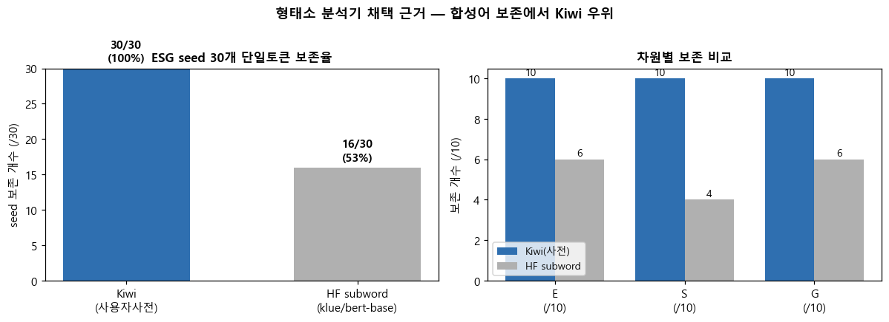
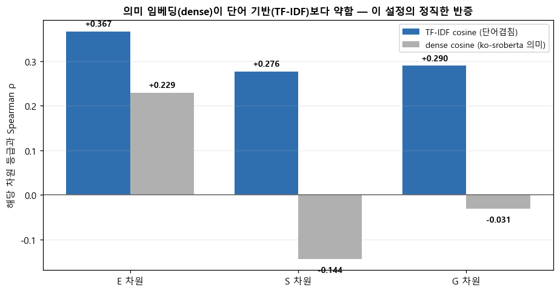
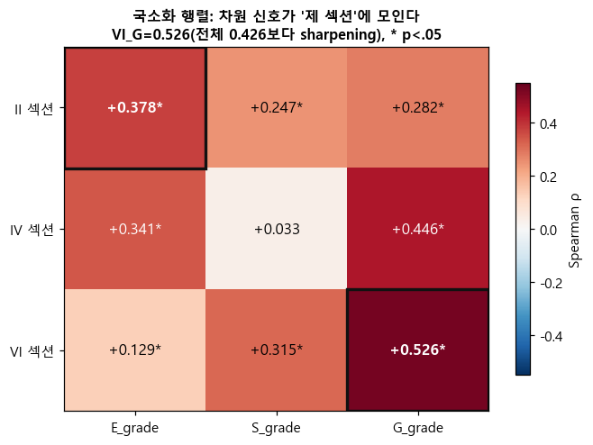

# 한국 상장기업 사업보고서의 ESG 어휘 강도는 KCGS 등급을 설명하는가: 공시 장황성 통제와 지배구조 신호의 섹션 국소화

**김혜성, 이동원, 김지우, 신지영**

비정형 데이터 처리 Final Term Project | 3조

---

## 초록

상장기업이 사업보고서에 적는 ESG 관련 표현과 한국ESG기준원(KCGS) 외부 ESG 등급의 통계적 연관을 분석하였다. 127개 상장기업의 2022–2024 회계연도 사업보고서 381 firm-year에서 환경(E)·사회(S)·지배구조(G) 어휘 강도를 TF-IDF seed 사전·FastText 확장 사전·기준 문장 cosine으로 측정하고, OLS·Ordered Logit·Binary Logit으로 공시 분량을 통제한 뒤 등급과의 관계를 확인하였다. 가장 강한 연관은 ESG 어휘가 아니라 단순 토큰 수에서 나타났으며(Spearman ρ=0.663), A 이상 등급 기업의 사업보고서는 B+ 이하보다 평균 2.1배 길었다. 이는 공시 분량이 외부 평가와 함께 움직이는 cheap-talk 가능성을 보여준다. 다만 분량과 기업 규모를 함께 통제한 뒤에도 G 확장 어휘는 독립 신호를 유지하였고(β=1.955, p<0.001), E는 규모 통제 시 사라졌으며 S는 모든 모형에서 비유의였다. 분량을 통제하고 남은 G 신호는 이사회 등 기관을 다루는 VI 섹션에 집중되어, 그 섹션에서 측정할 때 등급과의 상관이 전체 문서 기준 0.426에서 0.526으로 더 선명해졌다. 이 패턴은 사전에 의존하지 않는 의미 임베딩 분류에서도 재현되었다(VI 문장의 97.9%가 G로 분류). 모든 결과는 연관 관찰이며 인과로 해석하지 않는다.

---

## 1. Introduction

ESG 공시는 외부 평가기관이 등급을 매기는 주요 근거다. 그렇다면 사업보고서에 ESG 표현을 더 많이, 더 구체적으로 적는 기업일수록 등급도 높을 것이라 기대할 수 있는데, 이 기대에는 두 해석이 얽혀 있다. 하나는 실제 ESG 활동이 활발한 기업이 보고서에도 관련 내용을 충실히 담는다는 해석이고, 다른 하나는 규모가 크고 공시 역량이 높은 기업이 어떤 주제든 길고 정교하게 써서 어휘량과 등급이 함께 높아진다는 해석이다. 본 연구는 후자를 cheap-talk이라 부른다. 이는 허위 공시라는 단정이 아니라, 공시 언어의 양과 외부 평가가 강하게 연동되어 실제 성과와 표현 사이에 괴리가 생길 수 있다는 측정상의 경계 개념이다. 사업보고서 텍스트로 ESG를 측정하려는 시도가 이 cheap-talk과 실질 신호를 구분하지 못하면 "보고서가 긴 기업이 등급도 높다"는 동어반복에 빠진다. 따라서 본 연구의 문제의식은 분량 효과를 걷어낸 뒤에도 남는 ESG 신호가 있는가, 있다면 어떤 차원의 어느 부분 신호인가에 있다.

ESG 등급 자체의 신뢰성은 이미 폭넓게 지적되어 왔다. Berg, Koelbel, and Rigobon(2022)은 주요 6개 평가기관의 ESG 등급 상관이 0.38–0.71에 그쳐 신용등급의 0.99와 대비되며 불일치의 절반 이상이 측정 방법 차이에서 비롯된다고 분석하였다. 단일 등급을 정답처럼 다루기 어렵다는 이 결과는 본 연구가 KCGS 등급과의 관계를 인과가 아닌 연관으로만 해석하는 근거가 된다. 한편 Loughran and McDonald(2011)는 범용 감성 사전을 금융 공시에 적용하면 다수 단어가 도메인 맥락과 어긋난다는 점을 보이고 공시 특화 사전의 필요성을 주장하였는데, 이는 외부 사전 대신 분석 corpus 자체에서 학습한 임베딩으로 ESG 확장 사전을 구축한 본 연구의 선택과 맞닿는다.

분석 단위는 회사명이 아니라 `stock_code × fiscal_year` firm-year이며 두 질문에 답한다. 첫째, ESG 어휘 강도는 등급과 연관되며 그 연관은 분량 통제 후에도 유지되는가. 둘째, 남은 신호는 보고서 어느 섹션에 집중되는가. 기여는 두 가지다. 공시 분량 효과를 분리하여 세 차원이 분량·규모 통제에 서로 다르게 반응함을 보였고(G 견고, E 규모 교란, S 비유의), 섹션 분석으로 지배구조 신호가 이사회 공시 섹션에 국소화되어 그곳에서 더 선명해짐을 사전 기반과 의미 임베딩 양쪽에서 정량화하였다.

---

## 2. Data

표본은 KCGS ESG 등급을 보유한 상장기업 127개를 2022·2023·2024 세 회계연도로 확장한 381 firm-year다. 한 기업을 한 관측치로 두면 연도별 공시 변화가 사라지므로 firm-year를 단위로 삼되, 한 기업이 세 해 반복 관측되어 완전 독립은 아니라는 점은 한계로 남는다. 결합 키로 회사명을 쓰지 않은 이유는 사명 변경·표기 차이로 인한 오매칭 때문이다. 실제 고유 회사명은 133개였으나 고유 종목코드는 127개였다. 종목코드는 항상 6자리 문자열로 처리해 `005930`이 `5930`으로 읽혀 매핑이 실패하는 일을 막았다. 등급은 D=0부터 A+=5까지 순서형으로 부호화하였고, 간격이 같다는 가정이 아니므로 순위 기반 통계를 먼저 보고 회귀도 한 모형에만 의존하지 않았다. 공시와 평가 시점은 `esg_year = fiscal_year + 1`로 정렬해, 평가연도 t의 등급을 직전 회계연도 사업보고서와 맞추었다.

수집은 재현성을 위해 회사명 검색 대신 `stock_code → corp_code → rcept_no → document.xml` 경로를 남겼다. 사업보고서만 남기고 반기·분기 등을 걸러내되, 같은 회계연도에 정정공시가 여럿이면 최신 확정본을 택하고 결산월에 의존하지 않는 방식으로 검색해 비12월 결산 기업의 누락을 막았다. 수집 실패 행은 0점으로 채우지 않았는데, 텍스트 부재와 수집 실패는 의미가 다르기 때문이다. 다만 최종적으로 381건 전부 수집에 성공하였다.

분석에는 보고서 전체가 아니라 II(사업의 내용)·IV(이사의 경영진단)·VI(이사회 등 기관) 세 섹션만 추출하였다. 재무제표 주석·표·안내문이 ESG 어휘 측정을 흐릴 수 있어, ESG 서술이 실제 문장으로 나타나는 구간만 남기려는 선택이다. 세 섹션의 역할은 다르다. II는 환경·사회 표현이 가장 많은 본문, IV는 경영진의 자발적 서술, VI는 지배구조 공시의 핵심이다. 기업별 세부 항목명은 달라도 대분류 구조는 안정적이므로 로마숫자 대분류 제목만 경계로 삼았고, 형태소·TF-IDF를 왜곡하는 표 블록을 제거했으며, 파싱 실패 조각을 본문으로 오인하지 않도록 너무 짧은 텍스트를 제외하였다. 그 결과 세 섹션 모두 0자인 firm-year는 없었다.

추출 텍스트의 글자 수는 평균 34,773자였으나 최소 4,513자에서 최대 189,606자까지 약 42배의 편차를 보였다. 보고서가 길면 어떤 단어든 더 많이 등장하므로, ESG 어휘가 많다는 사실만으로 성과가 좋다고 해석하면 분량 효과를 신호로 착각한다. 따라서 이후 모든 회귀에 분량을 로그 변환한 `log_n_tokens`를 통제변수로 넣었다. 이 변수는 단순 보조 통제가 아니라 cheap-talk 가능성을 정면으로 점검하는 핵심 변수다.

| 항목 | 평균 | 중앙값 | 최소 | 최대 | 편차비 |
|---|---:|---:|---:|---:|---:|
| 글자 수 | 34,773 | 25,872 | 4,513 | 189,606 | 42.0배 |

*표 1. 사업보고서 추출 텍스트 글자 수 분포 (381 firm-year)*

---

## 3. Method

### 3.1 형태소 분석기 선택

한국어는 조사·어미가 결합하고 복합명사가 많아 공백 토큰화만으로는 ESG 개념을 안정적으로 세기 어렵다. `재생에너지`·`감사위원회`가 `재생+에너지`처럼 쪼개지면 feature가 본래 개념을 잃으므로, 분석기 선택 기준은 속도가 아니라 ESG 핵심 어휘 보존율이었다. Kiwi는 기본 상태에서 seed 30개 중 18개(60%)를 보존했으나 사용자 사전(score=50)을 적용하자 28개(93%)로 올랐고, Okt는 20개(67%), BERT subword(klue/bert-base)는 합성어를 잘게 나누어 16개(53%)에 머물렀다. 사전 기반 점수에는 합성어 보존이 필수이므로 Kiwi 사용자 사전을 채택하였다. 불용어는 일반 경영어·회사명 분해 토큰·정형어를 줄이되, `에너지`처럼 회사명에서 분해된 ESG 관련어가 사라지지 않도록 seed 30개는 강제로 보호하였다.

**그림 1. 형태소 분석기 seed 보존율 비교**

*Kiwi 사용자 사전(짙은 막대)이 전 차원에서 ESG seed를 가장 많이 보존한다.*

### 3.2 TF-IDF와 seed score

TF-IDF는 특정 문서에서 자주 나오면서 전체 corpus에서는 흔하지 않은 단어에 높은 값을 준다. 파라미터는 희귀어 노이즈 제거를 위한 `min_df=5`, 보일러플레이트 제거를 위한 `max_df=0.80`, 반복어 과대반응 완화를 위한 `sublinear_tf=True`를 두었다. `max_df=0.80`은 `이사회`·`주주` 같은 G seed 7개를 어휘에서 제외하는데, 이것이 G 신호를 인위적으로 죽인 선택인지 확인하기 위해 `max_df`를 1.00까지 높이며 seed_G와 g_grade 상관을 추적하였다.

**그림 2. max_df 값에 따른 seed_G ↔ g_grade Spearman ρ 변화**

*0.80–0.95에서 ρ는 0.27–0.30으로 안정적이나, 0.99에서 0.108로 급락하고 1.00에서 −0.162로 반전된다.*

보편적 의무공시 어휘를 넣을수록 신호가 무너지고 끝내 음으로 뒤집히는 것은, 그 어휘가 변별력이 없을 뿐 아니라 많이 쓰는 것이 높은 등급의 지표가 아니라는 뜻이다. 따라서 `max_df=0.80`은 G 신호 보존에 필요한 견고한 선택이며, seed_G가 약한 것은 파라미터 부작용이 아니라 의무공시 어휘 자체의 한계를 드러낸 진단이다. 차원별로 E·S seed는 10/10이 어휘에 포함되었으나 G는 3/10에 그쳐, 이것이 확장 사전 도입의 직접적 이유가 되었다.

### 3.3 FastText 기반 확장 사전

seed 30개만으로는 기업이 실제 쓰는 다양한 표현을 포착하기 어렵다. 외부 사전 대신 분석 corpus에서 FastText를 학습했는데, skip-gram은 문서가 적을 때(381건) 희소 단어 학습에 유리하고, `min_count=3`은 `넷제로`·`부패방지` 같은 저빈도 핵심어가 더 높은 기준에서 제외되는 위험을 피한다. 확장 후보는 seed와의 cosine 유사도 임계값 θ를 넘는 단어로 정했다. θ를 0.55–0.75로 훑어 후보 수·잡음·검토 가능성을 비교한 결과 θ=0.65를 택했다. θ=0.60(770개)은 직접 검토가 비현실적이고 θ=0.70(286개)은 희소한 S 후보를 잃는 반면, θ=0.65는 약 493개로 사람이 전수 검토할 수 있으면서 잡음 비율이 1.0% 수준이었다. 임베딩은 고유명사·시사 노이즈도 가까운 후보로 가져오므로 FastText 후보를 그대로 쓰지 않고, 자동 필터(2자 미만·숫자·중복 제거) 후 사람이 인명·지명·오분리 등을 직접 기각하였다. 초기 660개가 자동 필터로 475개, 수동 검토로 433개가 최종 확정되었으며, 기각률은 S에서 40.7%로 가장 높아 S 신호의 희소성을 다시 확인하였다. 확장 점수는 seed 대비 E +195%·S +63%·G +2185%로 G에서 보완 효과가 가장 컸다.

### 3.4 측정 타당도 교차검증

사전 기반 TF-IDF가 ESG 의미를 제대로 잡는지 점검하기 위해, 한국어 문장 임베딩(ko-sroberta-multitask)으로 의미 유사도(dense cosine)를 계산해 TF-IDF cosine과 비교하였다.

**그림 3. 의미 임베딩(dense)과 단어 기반(TF-IDF) cosine의 등급 상관 비교**

*세 차원 모두 TF-IDF의 ρ가 dense보다 높다(E 0.367 vs 0.229, S 0.276 vs −0.144, G 0.290 vs −0.031). dense는 S·G에서 등급과 역방향이거나 무의미하다.*

최신 의미 임베딩이 항상 낫다는 통념과 달리, 짧은 기준 문장과 긴 문서를 비교하는 이 설정에서는 의미 임베딩이 다양한 서술을 한 점으로 압축해 변별력이 떨어지고 일반 도메인 모델이라 공시체 표현을 놓쳤다. 이 정직한 반증은 본 분석이 TF-IDF 계열을 주력 feature로 삼는 선택이 이 과제에서 타당함을 역으로 뒷받침한다.

### 3.5 회귀 설계

서열형 등급의 성격을 고려해 세 모형을 병행하였다. OLS는 직관적 baseline, Ordered Logit은 등간성을 가정하지 않는 순서 모형, Binary Logit(A 이상 여부)은 해석이 쉬운 강건성 확인용이다. 모든 모형에 분량(`log_n_tokens`)을 넣어 분량 효과를 제거했고(M1), 기업 규모가 분량과 등급을 동시에 끌어올리는 교란일 수 있어 규모·수익성·재무위험을 추가 통제한 모형(M2, n=344)도 추정하였다. seed·expanded·cosine은 상호 상관이 높아(E r=0.937) 한 식에 같이 넣지 않고 set별로 나누어 결론의 반복을 확인하였다.

---

## 4. Results

### 4.1 공시 분량이 ESG 어휘보다 강하게 연관된다

회귀 전, 등급 4종과 feature 10개를 교차한 40개 검정을 BH-FDR로 보정한 결과 모두 p<0.01로 유의했다. 그러나 핵심은 ESG 어휘가 아니라 단순 토큰 수가 등급과 가장 강하게 연관되었다는 점이다.

| feature | ESG 통합등급 ρ | feature | ESG 통합등급 ρ |
|---|---:|---|---:|
| **n_tokens** | **0.663** | seed_score_E | 0.306 |
| expanded_score_G | 0.425 | seed_score_G | 0.248 |
| expanded_score_E | 0.373 | expanded_score_S | 0.212 |

*표 2. 주요 feature와 ESG 통합등급 간 Spearman ρ (FDR 보정 후 40/40 유의)*

토큰 수의 ρ=0.663은 어떤 개별 ESG feature(최대 0.451)보다 높다. A 이상 기업(138건)의 평균 토큰 수는 7,523으로 B+ 이하(243건)의 3,547보다 약 2.1배 많았고, Mann-Whitney U 효과크기는 r=0.649로 강했다. Binary Logit에서 `log_n_tokens`의 승산비는 약 7.9로, 토큰 수가 e배(약 2.7배) 늘 때 A 이상 등급일 odds가 약 8배 높아진다(확률이 8배가 아님에 유의). ESG feature는 모두 유의했으나 효과는 약함~중간에 머물렀고, 가장 큰 연관은 분량이 차지했다.

### 4.2 분량·규모를 통제하면 G만 독립 신호로 남는다

분량을 통제한 OLS(M1)에서 확장 모형의 R²은 0.476, `log_n_tokens` 계수가 1.297(p<0.001)로 가장 컸다. ESG feature 중에서는 expanded_G만 강하게 유의했고(β=3.174, p<0.001), expanded_E는 약하게(β=0.432, p=0.025), expanded_S는 비유의였다(β=−0.695). Ordered·Binary Logit에서도 expanded_G가 같은 방향으로 유의해(β=4.944, OR=27.1) 결론이 모형 선택에 좌우되지 않았다. 다음으로 기업 규모 교란을 분리하기 위해 재무변수를 추가하였다(M2).

**그림 4. 분량 통제(M1)와 재무통제 추가(M2)에 따른 ESG feature 계수 변화**

*expanded_G(파란 점)는 M2에서도 유의하게 유지되고, expanded_E(빨간 점)는 유의성이 사라진다.*

| feature | M1 β | M2 β | M2 p | 판정 |
|---|---:|---:|---:|---|
| expanded_G | +3.174 | +1.955 | <0.001 | ★ 견고 |
| expanded_E | +0.432 | +0.172 | 0.396 | 유의성 소멸 |
| expanded_S | −0.695 | −0.070 | 0.918 | 비유의 |
| log_n_tokens | +1.297 | +0.718 | <0.001 | 절반↓이나 견고 |

*표 3. OLS 회귀 — 확장 사전 feature set. M2는 분량+재무(log_assets·roa·leverage) 통제, n=344. R² 0.476→0.551.*

G는 규모·수익성·재무위험 통제 후에도 독립 신호를 유지하였다(β=1.955). 실제 분포로 환산하면 1 표준편차 증가가 약 0.26등급 상승에 해당해, 분량만 통제했을 때의 약 0.42등급에서 줄지만 여전히 유의하다. 반면 E는 재무 통제 후 유의성이 사라져, M1의 환경 신호 상당 부분이 기업 규모 교란이었음이 드러났다. S는 분량만 통제한 단계에서도 비유의여서 사업보고서만으로는 사회 차원 측정이 어려움을 확인하였다. 분량 자체는 재무 통제 후 절반으로 줄었지만 여전히 강하게 유의해, cheap-talk이 단순 규모 효과로 환원되지 않음을 보강한다.

### 4.3 G 신호는 이사회 공시 섹션(VI)에 국소화된다

남은 G 신호가 어느 섹션에서 오는지 추적하기 위해, 합본 텍스트를 II·IV·VI로 복원하고 섹션별 어휘 강도를 산출하였다. 섹션 점수와 해당 차원 등급의 Spearman ρ는 차원 신호가 자기 섹션에 모이는 패턴을 보인다.

**그림 5. 섹션별 어휘 강도와 차원 등급 간 Spearman ρ 히트맵**

*VI_G가 0.526으로 가장 진하며 전체 문서 기준 G 상관(0.426)을 넘어선다. E는 II·IV에 분산되고 S는 일관된 신호가 없다.*

| ρ(섹션, 차원 등급) | E | S | G |
|---|---:|---:|---:|
| II (사업내용) | +0.378 | +0.247 | +0.282 |
| IV (경영진단) | +0.341 | +0.033ⁿˢ | +0.446 |
| VI (기관) | +0.129 | +0.315 | **+0.526** |
| 전체 문서 | 0.451 | 0.230 | 0.426 |

*표 4. 섹션 국소화 행렬. ⁿˢ=p≥0.05, 그 외 p<0.05.*

VI_G의 0.526이 전체 문서 0.426을 넘는다는 것은 지배구조를 그것이 공시되는 섹션에서 잴 때 신호가 더 선명해진다는 뜻이다. 이 효과가 단지 VI가 짧아 어휘 밀도가 높아진 결과일 가능성을 배제하기 위해 섹션 글자 수와 전체 분량을 함께 통제하자, VI_G(β=1.738)·IV_G(β=1.969)는 유의했으나 II_G(β=0.464, p=0.320)는 길이에 흡수되었다. 환경은 반대로 II_E(β=0.592)가 실질이고 IV_E는 흡수되었다. 거버넌스의 실질 서술은 기관·경영진단에 있고 사업내용의 거버넌스 언급은 보일러플레이트인 반면, 환경은 구조화된 사업내용이 실질인 것이다. 업종·연도 고정효과를 더해도 VI_G(β=1.755)·IV_G(β=2.079)·II_E는 견고했고, 특히 II_E는 0.592에서 0.723으로 강화되어 섹터 교란 통제 후에도 환경 신호가 남았다.

이 국소화가 확장 사전 매칭의 산물이 아닌지 확인하기 위해, 사전 없이 의미 임베딩으로 섹션 문장을 E/S/G/무관에 최근접 분류하였다.

**그림 6. 의미 임베딩 기반 섹션별 E/S/G 문장 비율 (60 firm-year 층화표본)**

*VI 섹션 문장의 97.9%가 G로 분류되어, 사전에 의존하지 않는 측정에서도 거버넌스 신호의 VI 집중이 재현된다.*

| 섹션 | E 비율 | S 비율 | G 비율 |
|---|---:|---:|---:|
| II (사업내용) | 0.060 | 0.047 | 0.106 |
| IV (경영진단) | 0.046 | 0.015 | 0.119 |
| VI (기관) | 0.001 | 0.008 | **0.979** |

*표 5. 의미 임베딩 최근접 분류 기반 섹션별 E/S/G 문장 비율.*

측정 방식을 의미 임베딩으로 바꿔도 G의 VI 집중이 그대로 나타났다. 다만 이 분류는 기준 문장 설계에 민감하고 층화표본에 기반하므로 본선을 대체하지 않는 방향성 교차검증으로만 해석한다.

---

## 5. Discussion

본 분석에서 가장 분명한 사실은 공시 분량의 지배력이다. 그러나 "분량이 지배적이다"에서 멈추면 그 아래 층위를 놓친다. 분량과 재무를 통제한 뒤에도 G 어휘, 특히 VI 섹션의 G 어휘에는 독립 신호가 남기 때문이다. 이 신호가 실제 거버넌스 품질을 반영하는지까지는 식별할 수 없으나, VI는 이사회·감사위원회·내부통제처럼 법적으로 의무화된 공시 영역이라는 점이 주목할 만하다. 의무공시 틀이 정보 생산 기능을 한다면, 보고서를 단순히 늘리는 것과 달리 VI의 구체적 거버넌스 서술은 측정 가능한 성과 차이와 연결될 여지가 있다. 반대로 규모 통제 후 사라진 E 신호는 환경 서술이 주로 기업 규모를 경유해 등급과 연관됨을, S의 일관된 비유의는 사회 차원이 사업보고서만으로는 안정적으로 측정되지 않음을 시사한다.

이는 ESG 공시를 정보로 활용하는 입장에서 두 함의를 갖는다. 첫째, 사업보고서 ESG 어휘량을 그대로 성과 대리지표로 쓰는 것은 위험하다. 가장 강한 신호가 어휘의 질이 아니라 분량이라는 사실은, 공시 텍스트를 신호로 삼을 때 disclosure verbosity를 반드시 분리해야 함을 보여주며, 이는 Berg et al.(2022)이 지적한 측정 의존성과 같은 맥락이다. 둘째, 그럼에도 측정을 정교화하면 의미 있는 신호를 분리할 수 있다. 거버넌스 신호가 의무공시 보편어가 아니라 실천 어휘에서, 전체 문서가 아니라 해당 섹션에서 더 선명해진다는 발견은 공시 텍스트 분석이 외부 평가를 보완하는 독립 정보를 제공할 수 있음을 시사한다.

해석에는 제약이 있다. 표본 381 firm-year는 수업용 pilot이라 전체 상장기업을 대표하지 않으며, KCGS 단일 등급만 사용해 결론이 평가기관 선택에 민감할 수 있다. 텍스트 원천을 사업보고서로 한정해 지속가능경영보고서는 빠졌고, S 등급은 A+에 112건이 몰려 분산이 작다. 무엇보다 모든 결과는 연관 관찰이며 인과가 아니다. ESG 어휘를 늘리면 등급이 오른다거나, 보고서를 길게 쓰면 평가가 개선된다거나, G 어휘가 풍부하면 실제 지배구조가 우수하다는 주장은 본 분석으로 도출할 수 없다.

---

## 6. Conclusion

사업보고서 ESG 어휘 강도와 KCGS 등급 사이에는 통계적 연관이 있으나, 가장 강한 요인은 ESG 어휘가 아니라 공시 분량이었다. 분량과 기업 규모를 통제하면 차원별 신호가 갈려 G는 독립 신호로 남고 E는 규모 교란으로 약해지며 S는 비유의에 머물렀으며, 남은 G 신호는 이사회 공시 섹션(VI)에 국소화되어 그곳에서 측정할 때 가장 선명했다. 요컨대 공시 텍스트라는 단일 자료 안에서도 측정의 차원과 섹션을 달리하면 cheap-talk과 실질 신호를 부분적으로 분리할 수 있으나, 보고서가 길고 그럴듯하다는 이유로 ESG 성과가 높다고 단정해서는 안 된다. 지속가능경영보고서나 복수 평가기관 등급을 결합하면 공시 언어와 실제 성과의 괴리를 더 정밀하게 추적할 수 있다.

---

## References

Berg, F., Koelbel, J. F., & Rigobon, R. (2022). Aggregate confusion: The divergence of ESG ratings. *Review of Finance, 26*(6), 1315–1344. https://doi.org/10.1093/rof/rfac033

금융감독원. (n.d.). OpenDART API 개발가이드. *전자공시시스템*. https://opendart.fss.or.kr

한국ESG기준원. (n.d.). ESG 평가 등급 안내. https://www.cgs.or.kr

Loughran, T., & McDonald, B. (2011). When is a liability not a liability? Textual analysis, dictionaries, and 10-Ks. *The Journal of Finance, 66*(1), 35–65. https://doi.org/10.1111/j.1540-6261.2010.01625.x

Park, B. (2024). Kiwipiepy: A morphological analyzer for Korean. https://github.com/bab2min/Kiwi

Pedregosa, F., et al. (2011). Scikit-learn: Machine learning in Python. *Journal of Machine Learning Research, 12*, 2825–2830.

Řehůřek, R., & Sojka, P. (2010). Software framework for topic modelling with large corpora. In *Proceedings of the LREC 2010 Workshop on New Challenges for NLP Frameworks* (pp. 45–50).
